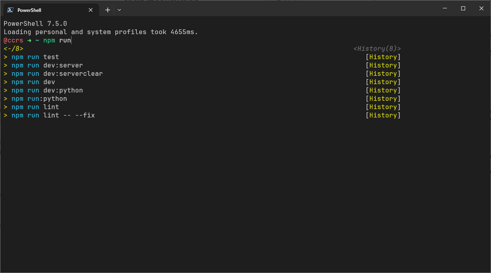

# Instalação de ambiente de desenvolvimento para Javascript/Typescript

## Ferramentas
- [Winget](https://learn.microsoft.com/pt-br/windows/package-manager/winget/) - Instalador de pacotes padrão do Windows
- [Node.js](https://nodejs.org/en/)
- [Visual Studio Code](https://code.visualstudio.com/)
- [Git](https://git-scm.com/)
- [Windows Terminal](https://www.microsoft.com/pt-br/p/windows-terminal/9n0dx20hk701?activetab=pivot:overviewtab)
- [OhMyPosh](https://ohmyposh.dev/)

## Execução

Etapa 1:
Observação: a execução do script `./step-one.ps1` faz a instalação de todas as ferramentas necessárias para o ambiente de desenvolvimento. O segundo script `./step-two.ps1` faz a configuração do terminal e do OhMyPosh. Procure mais informações antes de instalar no site oficial do OhMyPosh.

1. Execute como administrador o arquivo `./step-one.ps1`. Aguarde a execução do script. Caso ocorrer erro tente executar novamente.

2. Execute o arquivo `./step-two.ps1`. Aguarde a execução do script. Caso ocorrer erro tente executar novamente.

Ao final da instalação, abra o terminal e verifique se o OhMyPosh está funcionando corretamente.

